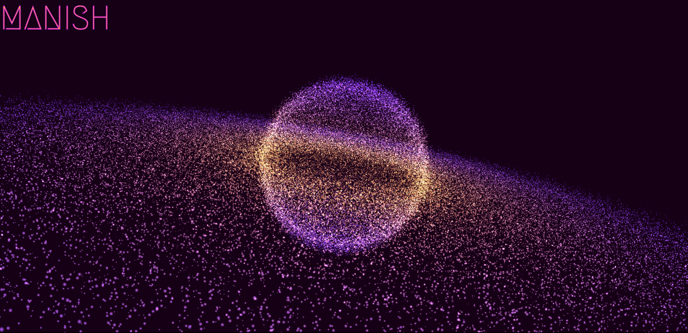

# [Rotating Planet 🪐](https://neon-planet.vercel.app/)

## Description
This project is a webpage that showcases an interactive rotating planet using HTML, CSS, and Three.js, a popular JavaScript library for creating 3D graphics in the browser.

## Features
- Rotating planet with a smooth animation
- Interactive model that respond to user input (e.g., mouse click and drag, scroll)
- Visually appealing design with a dark background

## Technologies Used
- HTML
- CSS
- JavaScript
- Three.js

## Getting Started
1. Clone the repository to your local machine.
2. Open the `index.html` file in your preferred web browser.

## Visual
<!--

-->

## Live Demo
You can view a live demo of the project [here](https://neon-planet.vercel.app/).

## Contributions
Contributions are welcome! If you have any suggestions or find any issues, please feel free to open a new issue or submit a pull request.

---

  

